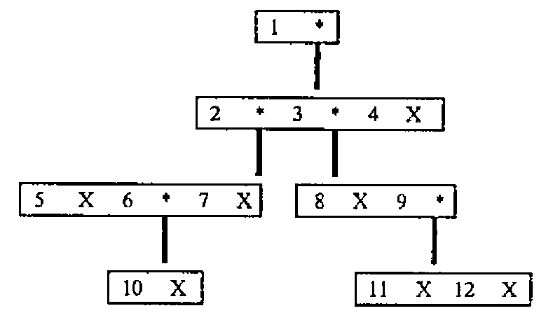

## Yet More Benchmarks …

<p>From N J Small<span style="float: right">16th September 1987</span></p>

Sir,

In case it has not been drawn to your attention before, you may be interested in the following comparison of timings made using APL\*PLUS/PC (running on an IBM PC/XT286) with those from “APL: A Design Handbook for Commercial Systems” (page 136). (I was unable to locate a reference to the machine and system to which these timings relate.) <<IBM 3032 running VS APL under VSPC …. Ed>>

```text
   Command                        APL*PLUS/PC    ???
M←100 500⍴'RABBITS '          :      .49 s
M1←M[⍳3;]                     :      .16 s     1.4  ms
M1←((1↑⍴M)↑3⍴1)⌿M             :     1.75 s     0.69 ms
M1←(3,1↓⍴M)↑M                 :     1.92 s     0.29 ms
```

Of course, the ratios of the various methods vary quite a bit with the size and shape of the object being handled (times approximate):

```text
M←100 300⍴'RABBITS '          :      .27 s
M1←M[⍳3;]                     :      .06 s
M1←((1↑⍴M)↑3⍴1)⌿M             :     1.10 s
M1←(3,1↓⍴M)↑M                 :     1.15 s

M←10 300⍴'RABBITS '           :      .06 s
M1←M[⍳3;]                     :      .06 s
M1←((1↑⍴M)↑3⍴1)⌿M             :      .16 s
M1←(3,1↓⍴M)↑M                 :      .16 s

M←100 30⍴'RABBITS '           :      .05 s
M1←M[⍳3;]                     :      .05 s
M1←((1↑⍴M)↑3⍴1)⌿M             :      .16 s
M1←(3,1↓⍴M)↑M                 :      .11 s
```

I was stimulated to perform these timings after observing that, if one is dealing with vector data, from a file, it can take much longer to take characters from the vector than it took to read the vector in the first place; in fact it can be much faster to re-read sub-strings than to pull them out of the vector in the workspace using indexing, if they are in a buffer. (Using take is worse than a read from the disk, for the case illustrated.) My figures were:

```text
Z←⎕NREAD ¯1 82 35497    0     :      .38 s
ZZ←⎕NREAD ¯1 82   999    0    :      .11 s
ZZ←⎕NREAD ¯1 82   999  999    :      .00 s
ZZ←⎕NREAD ¯1 82   999 9999    :      .11 s
ZZ←999↑Z                      :     2.97 s
ZZ←9999↑Z                     :     3.02 s
ZZ←Z[⍳999]                    :      .11 s
ZZ←999⍴Z                      :      .00 s
ZZ←((⍴Z)↑999⍴1)/Z             :     6.37 s
ZZ←((⍴Z)↑999⍴1)               :     3.24 s
```

Further investigation revealed the following, which I suppose one might have guessed at the start, if one had thought hard enough: certain magical properties of a well-known magical number combine to cause enormous overheads when the interpreter switches from two-byte to eight-byte integer arithmetic for indexing.

```text
ZZ←(¯1+2*15)↑Z                :     3.24 s
ZZZ←999↑ZZ                    :      .05 s
ZZ←(2*15)↑Z                   :     3.24 s
ZZZ←999↑ZZ                    :     2.74 s
```

I hope that the above provides some entertainment, even if it should be of no greater value to you.

Yours sincerely,

<p style="margin-left: 2em">Nicholas Small,<br>I.T. Systems Support,<br>Room 236,<br>National Westminster Bank,<br>41 Lothbury,<br>LONDON EC2P 2BP.</p>

## Trees in APL2

<p style="text-align: right">Mail Point 188,<br>IBM UK Laboratories,<br>Hursley Park,<br>WINCHESTER,<br>Hants. SO21 2JN</p>

Sir,

It was interesting to read in VECTOR 4.1 of Anne Wilson’s delight in finding how adaptable APL is to handling trees. Perhaps it would delight her further to see how the problems she discusses might be tackled in APL2.

First, model your tree! One way is as a vector with an even number of items – odd items are keys, even items are trees or the enclosed empty vector. In order to avoid a plethora of quotes, keys will be numbers rather than letters, so that the “typical tree” is :



Its APL2 definition is :

```apl
      X←⊂⍳0
      TREE←1(2(5 X 6(10 X)7 X)3(8 X 9(11 X 12 X))4 X)
```

To solve the subtree size problem use a function PATH which is the inverse of “pick” :

```apl
[0]   Z←L PATH R;T
[1]   Z←⍳0
[2]   →(0=≡R)/0
[3]   T←(L∊¨∊¨R)⍳1
[4]   Z←T,L PATH T⊃R

      7 PATH TREE
2 2 5
      8 9 10 PATH¨⊂TREE
 2 4 1  2 4 3  2 2 4 1
```

Subtrees and subtree size are then given by the functions

```apl
[0]   Z←L SUBT R
[1]   Z←(L STPATH R)⊃R

[0]   Z←L STPATH R;T
[1]   Z←(⌽(⍴T)↑1)+T←L PATH R
```

SUBT returns the subtree associated with key L :

```apl
      2 SUBT TREE
 5    6  10       7
```

and the sizes of subtrees are given by

```apl
[0]   Z←L SIZE R
[1]   Z←⍴∊(L STPATH R)⊃R

      (⍳12)SIZE¨⊂TREE
 11  4  4  0  0  1  0  0  2  0  0  0
```

STPATH is also used in functions to cut, copy, and cut and paste subtrees :

```apl
[0]   Z←L CUTFROM R
[1]   Z←R
[2]   ((L STPATH Z)⊃Z)←⊂⍳0

      2 CUTFROM TREE
 1   2    3   8    9   11    12         4

[0]   Z←L MOVE R
[1]   Z←R
[2]   ((L[1] STPATH Z)⊃Z)←(L[2] STPATH Z)⊃Z
[3]   Z←L[2] CUTFROM Z
```

e.g. cut the subtree at node 3 and paste it to node 7 :

```apl
      7 3 MOVE TREE
 1   2   5    6   10        7   8    9   11    12         3   4
```

Ancestors are found by a function very similar to PATH :

```apl
[0]   Z←L ANCIN R;T
[1]   Z←⍳0
[2]   →(L∊R)/0
[3]   T←(L∊¨∊¨R)⍳1
[4]   Z←R[T-1],L ANCIN T⊃R

      8 ANCIN TREE
1 3
```

All sets of ancestors are given by :

```apl
      (⍳12)ANCIN¨⊂TREE
   1  1  1  1 2  1 2  1 2  1 3  1 3  1 2 6  1 3 9
1 3 9
```

Finally to obtain nodes at the various levels, an auxiliary function and an auliliary operator are defined. The function ODDS selects the odd items from a vector :

```apl
[0]   Z←ODDS R
[1]   Z←((⍴R)⍴1 0)/R
```

and the operator LEV penetrates the depth of R to a prescribed level G before F is applied :

```apl
[0]   Z←(F LEV G)R
[1]   →(G<≡R)/L1
[2]   →0,⍴Z←F R
[3]   L1:Z←F LEV G¨R

      ODDS LEV 5 TREE
 1  2 3 4
```

(Note that the depth of the tree is 6).

The function LAYEROF completes the picture, and as with SIZE, all layers can be computed simultaneously using “each”.

```apl
[0]   Z←L LAYEROF R
[1]   Z←(∊ODDS LEV L R)~(L≠≡R)/∊ODDS LEV(L+1)R

      4 LAYEROF TREE
5 6 7 8 9
      6 5 4 3 LAYEROF¨⊂TREE
 1  2 3 4  5 6 7 8 9  10 11 12
```

Not only do the APL2 techniques appeal (to me at least!), but the original 7 pages have been reduced to 3 – a 57% reduction factor in favour of APL2!

Yours,

Norman Thomson.
