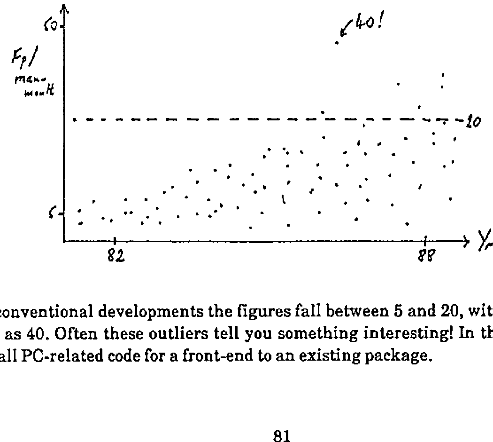
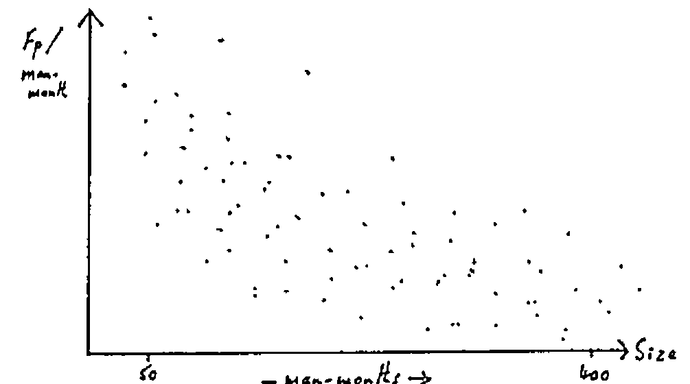

Alan Williams (IBM Project Management)
{ .byline }

## Why Measure Productivity?

Productivity is always one of the objectives of Systems Development; they might plan to improve it. What factors affect it? May be team size, environment are possibilities. To manage this improvement you first need an objective measure. Productivity is essentially the yield from the development process …. ‘work product’ / ‘work effort’ or ‘output’ / ‘input’.

## The History of FPA

It all began in the mid 70’s as a requirement within IBM for an estimating system. They looked at factors like environment, programming language, system size. By 1978 this had evolved into a need for measuring the output ‘work product’ independent of the environment.

The first thing was to decide what characteristics the ‘function point’ should have:

- it should be based on the user’s view of what he gets
- it should be independent of technique or environment
- it must measure the output from the whole process, not just ‘analysis’ or ‘coding’
- it needs to be measurable early in the development process
- it must be easy to count!

So … what does the user get? He gets: input, output, stored data, enquiries, processing. This is how you count them:

1. Decide what the system is. Draw the boundary.
2. Count the Inputs, Outputs, Logical Master Files, Interfaces, Enquiries.
3. Categorize these as Simple, Average, Complex.
4. Apply standard weights.
5. Add ’em up. This is called ‘the unadjusted function count’.

Processing complexity is assessed on a score of 0-5 for 14 factors (e.g. distributed, complex scientific) and added up to give a maximum score of 70. This is then normalized so that 1 represents a system of average complexity, and used to multiply the count resulting from item 5 above. The result is a ‘magic number’ which has no meaning on its own.

## When Do You Do It; What Do You Do With It?

The FPA is best done at two points: at the end of the external design, and when you implement the system. It is interesting to compare the two! (“I know we were two months late, but look … you got 200 more function points.”) The FPA counts can be done by questionnaire or some kind of automated tool; it should be agreed with the user, and checked by an FPA co-ordinator to ensure consistency.

The data can be used to measure Fn-pts/Man-month during development, and Man-mths/FP during maintenance, both over a long time period. The data is relatively dirty, and to see anything but noise you need to take a long view, say several hundred projects over at least 5 years:

For conventional developments the figures fall between 5 and 20, with the odd outlier as high as 40. Often these outliers tell you something interesting! In the example given it was all PC-related code for a front-end to an existing package.

Another useful plot is to show the productivity as a function of project size …

… this is sort of 1/x but flattens out above 50 man-months. One consequence of this effect is that IBM now limit individual projects to a maximum of one man-year.

## Current Status of FPA

FPA is the IBM internal standard for application development, although not for systems software … what is an ‘output’ from MVS (!). It is mainly aimed at business-type systems and is much less good where there is complex processing on little data.

The technique is widespread in the USA, and spreading in Europe. However it has the drawback of being impossible to update, as this immediately loses the benefit of consistent historical comparison. In response to Romilly’s three points:

1. Is it ‘old hat’? The basic paradigm of ‘Input & Output’ hasn’t changed, but how do you measure the ‘Output’ of a graph in terms of information content. However people are still making good decisions based on FPA measures.
2. Measurement of individual’s performance. This has never been done within IBM mainly because of the management culture and style. It can cause people (and teams) to fudge the figures! All you are trying to measure is team performance, however there is nothing in the method which prohibits a 1-man team.
3. It is not clear how APL could skew the analysis, so as far as we know the method is as valid for APL as for anything else.

If you want to know more, you need the “Productivity Measurement Guide” IBM reference SH19-6387, which fully describes the FPA technique.
